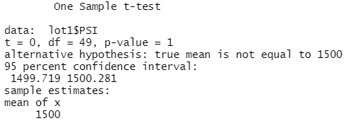

#  MechaCar_Statistical_Analysis
## Overview
Jeremy has worked at AutosRUs for 10 years and recently started a new role as a primary analyst.  His team is made of 5 other members and they are tasked with performing retrospective analysis of historical data.

## Resources
Software(s): R v 4.1.1, R Studio and libraries:  ggplot2

## Purpose
A few weeks after starting his new role, Jeremy is approached by upper management about a special project. AutosRUs’ newest prototype, the MechaCar, is suffering from production troubles that are blocking the manufacturing team’s progress. AutosRUs’ upper management has called on Jeremy and the data analytics team to review the production data for insights that may help the manufacturing team.

## Linear Regression to Predict MPG

Write a short summary using a screenshot of the output from the linear regression, and address the following questions:

* Which variables/coefficients provided a non-random amount of variance to the mpg values in the dataset?<br/>
Per the summary results, the vehicle length and vehicle ground clearance variables provide a non-random aount of variance.  Other variables have p-values that indicate a random amount of variance.<br/>

* Is the slope of the linear model considered to be zero? Why or why not?<br/>
Analysis indicates the slope of the linear model is not zero.  The ```p-value: 5.35e-11``` is much smaller than the 5% assumed significant level, indicating there is enough evidence to reject our noull hypothesis.<br/>

* Does this linear model predict mpg of MechaCar prototypes effectively? Why or why not?<br/>
This model predicts the mpg of MechaCar prototypes effectively.  The ```Multiple R-squared:  0.7149``` indicates that approximately 71% of all mpg predictions will be determined.<br/>

<br/>

## Summary Statistics on Suspension Coils

Write a short summary using screenshots from your total_summary and lot_summary dataframes, and address the following question:

* The design specifications for the MechaCar suspension coils dictate that the variance of the suspension coils must not exceed 100 pounds per square inch. Does the current manufacturing data meet this design specification for all manufacturing lots in total and each lot individually? Why or why not?<br/>

The current manufacturing data meets this design specification for all manufacturing lots in total with a Var_PSI of 62.29356 which is well within the 100 PSI variance as shown below:<br/>

<br/>

Performing different levels of analysis is critical to support overall findings and determine any outliers/anomalies.<br/>
- Lot1 has a Var_PSI of .09795918 which is significantly within the 100 PSI variance.<br/>
- Lot2 has a Var_PSI of 7.4693878 which is significantly within the 100 PSI variance.<br/>
- Lot3 has a Var_PSI of 170.2861224 which is NOT significantly within the 100 PSI variance. This lot is skewing the results of the total manaufacturing lots results.<br/>

The current manufacturing data for this design specification for each manufacturing lot individually is shown below:<br/>

<br/>

<br/>

## T-Tests on Suspension Coils

Summarize your interpretation and findings for the t-test results. Include screenshots of the t-test to support your summary.<br/>

Performing different levels of analysis is critical to support overall findings and determine any outliers/anomalies.  Supporting previous findings, there were obvious issues in the production cycle of Lot 3 which bear further investigation and correction.

The t-test analysis results reveal that for all lots, the ```p-value = 0.06028``` which is outside the significance level of 5%,  which indicates there is not sufficient evidence to reject the null hypothesis. The analysis predicts that the dataset mean of 1498.78 is statistically similar to the population mean of 1500.  The t-test results are shown below:<br/>

<br/>

The t-test analysis results reveal that for Lot 1, the ```p-value = 1``` which is outside the significance level of 5%,  which indicates there is not sufficient evidence to reject the null hypothesis. The analysis predicts that the dataset mean of 1500 is the same as the population mean of 1500.  The t-test results are shown below:<br/>

<br/>

The t-test analysis results reveal that for Lot 2, the ```p-value = 0.6072``` which is outside the significance level of 5%,  which indicates there is not sufficient evidence to reject the null hypothesis. The analysis predicts that the dataset mean of 1500.2 is almost the same as the population mean of 1500.  The t-test results are shown below:<br/>

<br/>

The t-test analysis results reveal that for Lot 3, the ```p-value = 0.04168``` which is inside the significance level of 5%,  which indicates there is sufficient evidence to reject the null hypothesis. The analysis predicts that the dataset mean of 1496.14 is not statistically different to the population mean of 1500.  The t-test results are shown below:<br/>

<br/>

